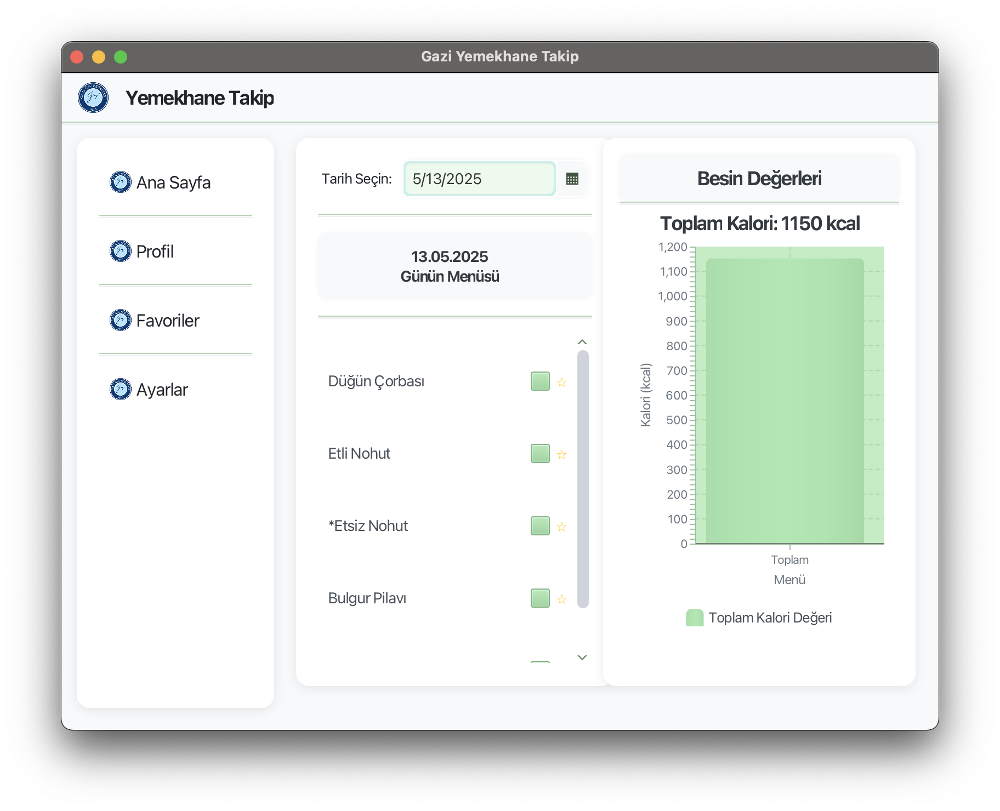
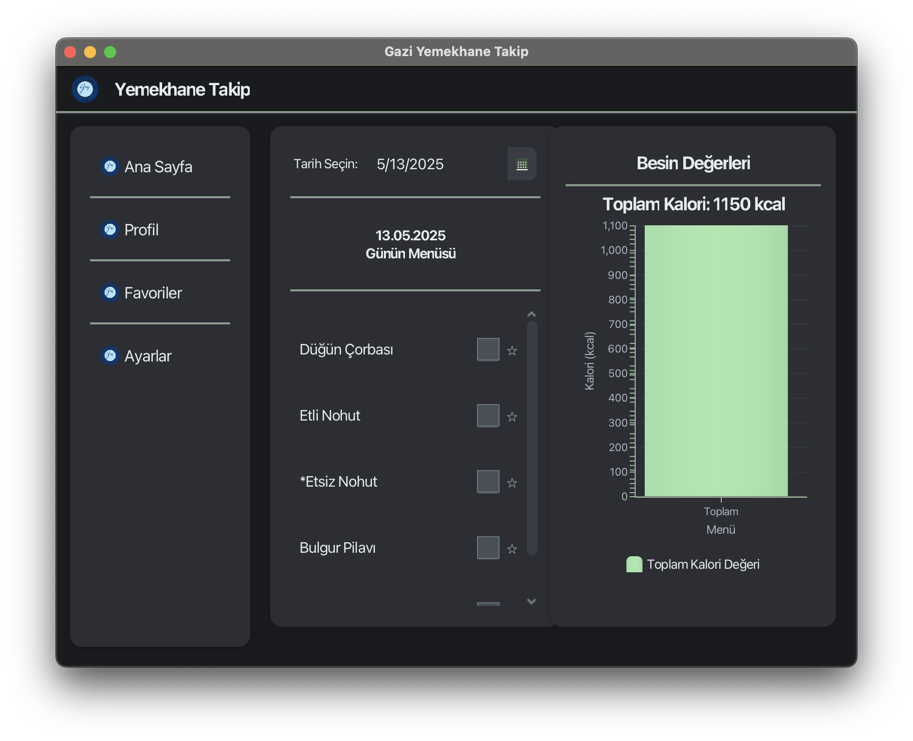

# Gazi Yemekhane Takip

A JavaFX application for tracking, rating, and favoriting meals from Gazi University cafeteria.

## Overview

This application scrapes Gazi University's cafeteria website to provide students with a convenient way to track daily menus, favorite meals, and rate food items. The application features a modern user interface with both light and dark themes, nutritional information, and user profiles.

## Features

-  **Real-time Menu Access**: Automatically scrapes and displays the current cafeteria menu from the Gazi University website.
-  **Favorites System**: Users can save their favorite meals for easy tracking.
-  **Nutrition Information**: View calorie information for each meal.
-  **User Profiles**: Create an account to save your preferences and favorites.
-  **Customizable Themes**: Choose between light and dark themes and custom colors.
-  **Meal Ratings**: Rate meals and see community ratings.
-  **Calendar View**: Browse past and future menus using an integrated calendar.

## Screenshots




## Tech Stack

- **Frontend**: JavaFX
- **Backend**: Java
- **Database**: MySQL
- **Web Scraping**: JSoup
- **Security**: JBCrypt for password hashing

## Installation

### Prerequisites

- Java 23 or higher
- MySQL Database
- Maven

### Database Setup

1. Create a MySQL database named `yemekhane`
2. Use the following credentials or update the `DatabaseManager.java` file with your database credentials:
   - Username: root
   - Password: rv9yl2qc
   - URL: jdbc:mysql://localhost:3306/yemekhane

### Building from Source

1. Clone this repository:
   ```bash
   git clone https://github.com/akdagdev/yemekhanetakip.git
   cd yemekhanetakip
   ```

2. Build the project using Maven:
   ```bash
   mvn clean package
   ```

3. Run the application:
   ```bash
   mvn clean javafx:run
   ```

## Usage

### Main Interface

The main interface displays the current day's menu with nutrition information. You can:
- View meal details by clicking on a meal
- Add meals to favorites using the checkboxes
- Switch between different days using the date picker

### User Account

1. Register for an account to enable personalized features
2. Log in to access your profile and favorites
3. Rate meals and view your rating history

### Settings

Customize your experience through the settings panel:
- Toggle between light and dark themes
- Customize primary and secondary colors
- Adjust application preferences

## Project Structure

- `src/main/java/yemekhanetakip/` - Main package
  - `controllers/` - JavaFX controllers
  - `db/` - Database management classes
  - `scraper/` - Web scraping functionality
- `src/main/resources/yemekhanetakip/` - JavaFX FXML, needed images and CSS files

## Acknowledgments

- Gazi University for providing the menu data
- The JavaFX and MySQL communities for excellent documentation and support

## Status

### Completed
- ✅ Java web scraping of meals
- ✅ Needed controllers
- ✅ Theme customization
- ✅ Nutrition information display
- ✅ Menu calendar view
- ✅ Favorites system
- ✅ Rating foods
- ✅ General improvements
- ✅ User interfaces
